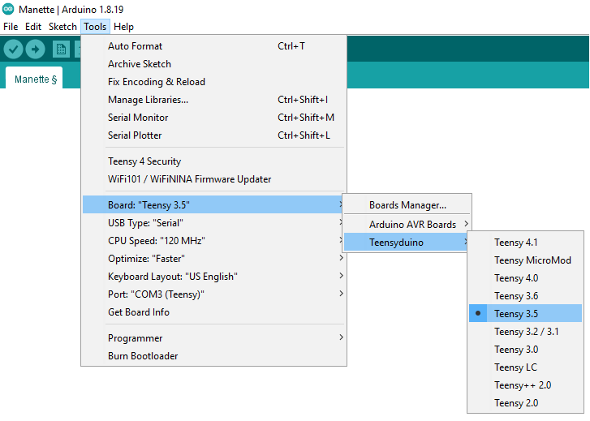
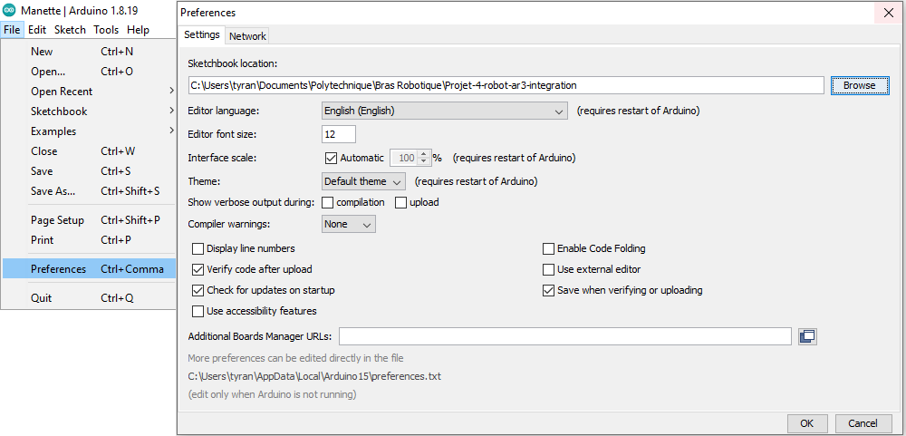

# Bras Robotique PolyOrbite
Ce projet est pris en charge dans le cadre d'un projet intégrateur de 4e année à Polytechnique par 11 étudiants de génie mécanique et électrique. Il consite à la fabrication d'un bras robotique pour la société technique PolyOrbite qui a pour but de servir lors des compétitions de la CIRC. La conception du bras se base sur le modèle AR3, un bras *open source* manufacturé par Annin Robotics. Des Teensy 3.5 sont utilisés à titre de microcontrolleurs afin de controller le bras robotique. Ce projet comporte ainsi des librairies permettant d'implémenter une manette et le controlleur du bras.

## Bien démarrer avec Teensy 3.5
1. Teensy 3.5 utilise principalement Arduino comme plateforme de programmation. Cependant Arduino ne supporte par directement Teensy, il faut alors commencer par installer Arduino et ensuite Teensyduino.
https://www.pjrc.com/teensy/td_download.html

2. Brancher alors le Teensy 3.5 à votre ordinateur à l'aide d'un cable micro USB. Une DEL devrait être allumée.
https://www.pjrc.com/teensy/first_use.html

3. Il faut enusite intaller le Teensy Loader afin de télécharger et rouler des programmes sur le Teensy.
https://www.pjrc.com/teensy/loader.html

4. Ouvrir Arduino et sous *Tools* sélectionner le bon *Board* et le *Port* associé au Teensy. \
Tools > Board > Teensyduino > Teensy 3.5 \
Tools > Port > PORT (COM3 dans ce cas ci)

5. Il faut alors indiquer où se trouve les *libraries*. Deux options s'offrent à vous :
   -  Changer l'emplacement du dossier où se trouve les librairies du projet sous File > Preferences > Sketchbook location.

   -  Importer directement les librairies du projet dans le dossier par défaut défini par Arduino. Le chemin défini peut se trouver sous File > Preferences > Sketchbook location.